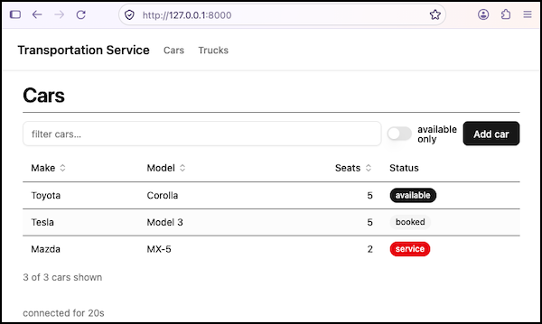

# pihanga-remote — a lean Pihanga runtime driven from Python

**Status:** prototype. It works end to end with the published
`@pihanga2/shadcn` **0.2.23** cards, which run unmodified.

pihanga-remote lets you drive a [Pihanga](https://github.com/ivcap-works/pihanga-core)
card UI entirely from Python: the browser loads one prebuilt generic bundle
(runtime + every shadcn card), a FastAPI/WebSocket backend owns the UI state
as a flat `{cardName: declaration}` map and pushes changes as JSON Patch
ops, and app authors write Python only — no JS, no bundling, no Vite.

## Table of contents

- [Documentation](#documentation)
- [Layout](#layout)
- [Quick start (run the demo)](#quick-start-run-the-demo)
- [Developing this repo](#developing-this-repo)

## Documentation

- **[HOW_TO_USE.md](HOW_TO_USE.md)** — build an app on the published
  `pihanga-remote` package: `build(session)`, cards and handlers,
  `AppOptions`, where backend processing goes, embedding the server on its
  own thread with thread-safe messaging, and publishing a new release to
  PyPI.
- **[DESIGN.md](DESIGN.md)** — how it works internally: the browser
  runtime, the wire protocol, local echo, the Python session/diffing
  machinery, how the typed card proxies are generated, the script-tag
  deployment model, and verification/findings.

## Layout

```
runtime/        TypeScript: the lean browser runtime (store, patch reducer, <Card>, WebSocket
                transport, stand-in for @pihanga2/core), the Vite builds for the single bundle
                and for the shared script-tag runtime, and the card-catalogue extractor
browser/        script-tag / import-map deployment: generic bootstrap page, the drop-in
                browser build for the pihanga-shadcn repo, and an example third-party card
                library written without a build step
schemas/        card catalogues (JSON Schema of props and event payloads) and hand-written
                event hints; input for the Python code generator
backend/        the Python package `pihanga-remote` (Poetry project): session and diffing,
                FastAPI server, code generator, the GENERATED card classes, both prebuilt
                browser bundles, plus examples/ and tests/
app-template/   a minimal app that depends on the published `pihanga-remote` package
```

## Quick start (run the demo)

```python
from pihanga_remote import create_app
from pihanga_remote.cards.shadcn import SdFramework, Stack, Typography, Button

def build(s):                                  # called once per browser tab
    count = Typography(text="0", level="h2")
    def inc(ev):                               # or inc(ev, ctx); may be async
        count.text = str(int(count.text) + 1)  # just mutate the proxy
    s.window(SdFramework(page=Stack(direction="column",
                                    content=[count, Button(label="+", on_clicked=inc)])))

app = create_app(build)
# save as mymod.py, then:  pip install pihanga-remote && python -m uvicorn mymod:app
#                          → open http://127.0.0.1:8000
```

```bash
make demo       # runs `poetry install` the first time, then
                # `poetry run python -m uvicorn examples.transport:app` → http://localhost:8000
make demo-cdn   # the script-tag version → http://localhost:8010
```



Without make, from `backend/`: `poetry install`, then `poetry run python -m
uvicorn examples.transport:app --reload`.

See [HOW_TO_USE.md](HOW_TO_USE.md) to build your own app on the published
package.

## Developing this repo

The Python side is a [Poetry](https://python-poetry.org) project
(`backend/pyproject.toml`, `backend/poetry.lock`). The virtualenv is created
in `backend/.venv` (`backend/poetry.toml` sets `in-project = true`). Tested
with Poetry 2.1.1 and 2.5.1.

Tests: `make test` runs vitest plus `poetry run python -m pytest`. The
browser tests (`make e2e` / `e2e-cdn`, against a running demo) need
Chromium for the Playwright version in the lock file: run `make
install-browsers` once, or point `PW_CHROMIUM=/path/to/chrome` at an
existing Chromium.

To rebuild the JS side (only needed when the runtime or the card library
changes), run `make bundle`, `make schema` and `make proxies`. See the
`Makefile`.

To build the script-tag deployment from a local `pihanga-shadcn` checkout:
`make cdn SHADCN=../pihanga-shadcn`, then `make demo-cdn` (port 8010) and
`make e2e-cdn`.

For publishing a new `pihanga-remote` release to PyPI, see
[HOW_TO_USE.md § Publishing a new pihanga-remote release to PyPI](HOW_TO_USE.md#publishing-a-new-pihanga-remote-release-to-pypi).

For the internal design, the wire protocol, the codegen pipeline and what
was found/verified while building this, see [DESIGN.md](DESIGN.md).
